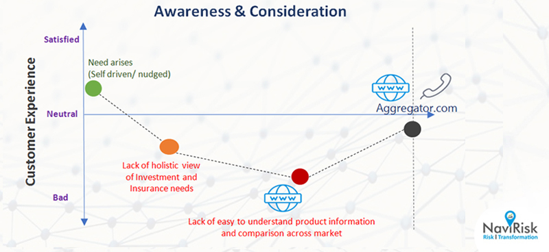
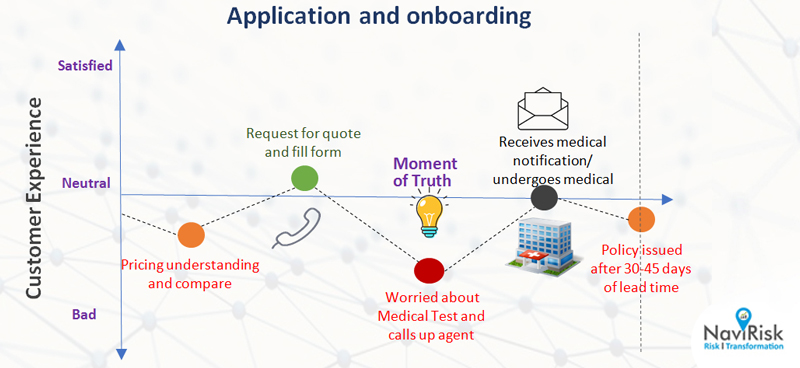
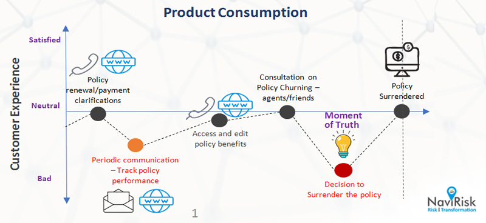

According to EY Global Consumer Insurance survey, insurance industry faces similar digital-driven and consumer-led disruption that retail, banking, media, and entertainment industries faced in the past. Customer experience is increasingly taking the front seat even in the financial services industry in which the customers expecting a personalized engagement to best utilize the products/services benefits. 

Customer retention is a significant problem faced by the Insurance industry globally and their poor penetration makes it even more difficult for Insurers to sustain the fierce competition and ever-changing customer expectations. A global Insurance industry survey revealed that in the last 18 months, 1 in 3 customers on an average decided to terminate or change their existing carrier. One of the key reason for this churning is lack of relevant communications with customers. Insurance industry needs to substantially prioritize the customer experience because acquiring new customers will cost them approximately 13 times more than what would be required to retain the existing ones.

What does it take to retain the customers? There are three key mantras that insurers need to focus on to solve this crucial business problem:

In this article, we will focus on first mantra: improving customer journey. The treatment of customer during her engagement with Insurer at all key touch points plays a vital role in customer’s decision to continue with the existing carrier or switch to another one. The focus should be on making the entire customer journey starting from onboarding to the termination a pleasant one.

In a typical Insurance company, the customer journey comprises 3 major phases.

## Awareness and Consideration Phase

In this phase, customers are determining their own needs and exploring various products and services options to fulfil their requirements. Major challenge of this phase is lack of connect between customer needs and appropriate Insurance products available. Personal engagement serves the need of understanding the customer’s requirements and to recommend the best product matching their needs. Insurers can utilize advanced analytics to:

- Better understand customer needs and devise products / services recommendations
- Build marketing campaigns based on target customers personas

## Application and Onboarding Phase

Finding the right product at the right price is a big challenge in this phase and arduous underwriting process makes things even more complicated and sometimes frustrating for customers. Proper communication with customers can help the Insurance agents better understand their need, which will eventually lead to finding the most appropriate product at the right price for the customer. Companies globally are focusing on imparting data science and automation for improving the accuracy and efficiency of complex and lengthy underwriting process. Also, efforts should be made to improve the transparency and reduce the complexities involved in onboarding the customers.

## Product(s) Consumption Phase:

In this phase, the major challenge is customer’s inability to get clear and accurate view of the product performance periodically. Furthermore, lack of appropriate engagement with customers in this phase substantially increases the chance of customer terminating the policy. Key to improving the customers experience in this phase is to initiate strategic engagement with customers and provide a single source of truth wherein customers can get a fair and accurate picture of the product performance. 
   
Advanced analytics can help Insurance companies better understand customers, which in turn can drive effective customer engagements. This approach could leverage internal customer data along with the external market data to develop an analytics engine to predict the customer behavior on utilization of the product. This would strengthen the customer engagement team to proactively and strategically engage with customers who are predicted to demonstrate adverse behavior. 

One of the major shortfalls we have seen in Insurance companies is lack of sophisticated feedback channels, which makes it difficult to get proper feedback from all the customers in every phase of engagement. These feedbacks could cover all stakeholders who are engaging with the customer – the distributor, underwriter, customer engagement team, and claims settler. These feedback data points then need to be incorporated in the advanced analytics of customers behavior to better understand their sentiments about the company. Also, the feedback could be utilized to devise improvements in the customer experience. 

To conclude, we think that Insurance industry is at an inflection point of customers engagements due to ever evolving customer expectations and increasing need of products innovations. Therefore, customers engagement innovation in Insurance industry should focus on:

- Personalized engagement based on data driven insights
- Improve digital presence by utilizing chatbots, Mobile Apps, and intuitive websites along with periodic updates/touch bases on:
  - Product performance
  - Education on product benefits and other related services
  - Personal life events such as birthdays, anniversaries, etc., and
  - In-person interactions with customers through strategically located customer centres

The target for Insurance companies should be to make the customers interaction more natural, constructive, enabling, less obligative, and less strenuous. In the wake of new generation of customers in the developing and developed markets, it is imperative for Insurance companies to not only embrace the technology but also increase the level of empathy for the customers so that they can be truly considered as a productive insurance partner that they can spend time with.

